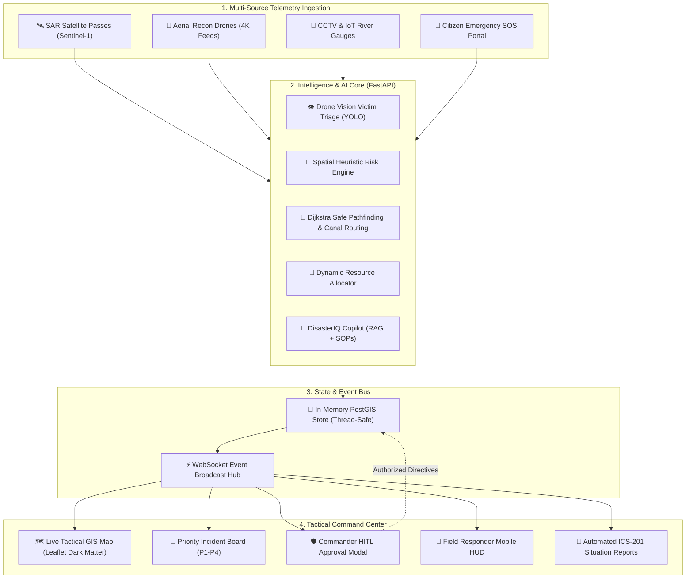
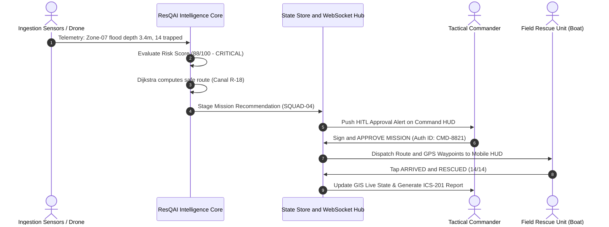
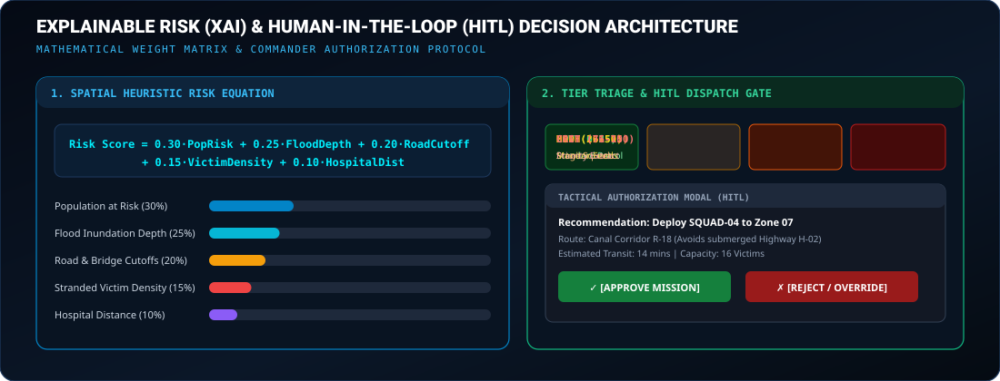

# 🚨 ResQAI (DisasterIQ) — Autonomous Multi-Source Disaster Intelligence & Tactical Mission Control Platform

<p align="center">
  
</p>

<p align="center">
  <a href="#-quick-start"></a>
  <a href="#-system-architecture"></a>
  <a href="#-command-center-frontend"></a>
  <a href="#-heuristic-risk--xai-engine"></a>
  <a href="#-human-in-the-loop-hitl-guarantee"></a>
  <a href="LICENSE"></a>
</p>

---

## 📌 Executive Overview & Problem Statement

During catastrophic disasters (such as cyclones, urban inundations, and coastal flash floods), emergency management authorities face severe **information fragmentation**. Raw sensor readings, synthetic aperture radar (SAR) satellite passes, aerial drone reconnaissance feeds, and frantic civilian emergency calls arrive across disconnected silos. Field dispatchers lack:

1. **Holistic Situational Awareness**: No unified spatial view integrating flood depth, road cutoffs, and hospital capacity.
2. **Explainable Triage (XAI)**: Inability to quickly prioritize which isolated civilian clusters require immediate life-saving extraction.
3. **Safe Dynamic Routing**: Convoys get delayed or trapped by submerged culverts and impassable highway choke points.

### The Solution: ResQAI (DisasterIQ)
**ResQAI** is an enterprise-grade, SIH-ready, operational decision-support intelligence platform that fuses multi-source telemetry to automate detection, assess infrastructure damage, compute explainable risk scores, optimize safe water/road transit routes, allocate response units, and generate official situation reports.

---

## 🛡️ Human-in-the-Loop (HITL) Guarantee

> **CRITICAL DECISION-SUPPORT GUARANTEE:**
> ResQAI strictly operates as a decision-support system. High-impact emergency actions (dispatching rescue boats, hospital evacuations, zone cordon-offs) require explicit **Human-in-the-Loop** commander authorization (`[APPROVE]` / `[REJECT]`). AI recommendations are paired with transparent heuristic rationales, contributing factor breakdowns, and verified emergency operating procedure (NDMA/NDRF) citations.

---

## 🏗️ System Architecture

<p align="center">
  
</p>



### Incident-to-Dispatch Lifecycle



---

## 🧠 Core AI Engines & Mathematical Formulations

<p align="center">
  
</p>

### 1. Spatial Heuristic Risk & Hazard Engine (XAI)
Every geographic sector receives a dynamic, explainable risk score ($0–100$) calculated continuously from physical telemetry:

$$\text{Risk Score} = 0.30 \cdot \text{PopRisk} + 0.25 \cdot \text{FloodDepth} + 0.20 \cdot \text{RoadCutoff} + 0.15 \cdot \text{VictimDensity} + 0.10 \cdot \text{HospitalDistance}$$

| Risk Tier | Score Range | Operational Meaning | Recommended Protocol |
| :---: | :---: | :--- | :--- |
| **LOW** | `0 – 25` | Normal baseline monitoring | Routine automated sensory telemetry sweeps |
| **MODERATE** | `26 – 50` | Rising river levels / low water pooling | Pre-stage rescue crafts at nearby staging hubs |
| **HIGH** | `51 – 75` | Severe inundation & access cutoffs | Mobilize NDRF / SDRF units for rapid deployment |
| **CRITICAL** | `76 – 100` | Imminent life threat / submerged structures | Immediate tactical air/boat extraction mission |

### 2. Flood-Aware Safe Pathfinding & Watercraft Routing
The routing engine applies a modified **Dijkstra algorithm** on a directed road and canal graph $G = (V, E)$. When floodwaters submerge roads ($> 0.5\text{m}$), highway edges are penalized with infinite travel weight, automatically pivoting dispatchers to navigable inland water corridors (e.g., Canal Corridor R-18) for motorized Zodiac boats.

### 3. Aerial Drone Computer Vision & Victim Detection
Trained on aerial flood reconnaissance footage, the computer vision subsystem (`vision_engine.py`) detects trapped civilians on building rooftops, partially submerged vehicles, and tree canopies with confidence metrics and bounding coordinates.

### 4. DisasterIQ Copilot (Conversational RAG)
An operational AI copilot backed by retrieval-augmented generation (RAG) referencing official **NDMA (National Disaster Management Authority)** and **NDRF** Standard Operating Procedures (SOPs). Responders can query:
> *"Which sector requires priority watercraft dispatch and what is the protocol for stranded pediatric patients?"*
The copilot queries active GIS telemetry and cites NDMA SOP Section 4.2.

### 5. Deterministic 7-Stage Disaster Simulation
A built-in deterministic simulator modeling the **Mahanadi Delta Catastrophic Inundation** across 8 high-risk coastal zones in Odisha. It includes playback controls ($\times 1, \times 2, \times 5$), step-by-step water surges, bridge collapses, and incident triggers.

---

## 💻 Command Center Frontend Modules

The ResQAI Tactical Command Center provides 11 dedicated operational interfaces built with React 18, modern JavaScript (ESM/JSX), Tailwind CSS, and Leaflet GIS:

| View | Route | Operational Function |
| :--- | :---: | :--- |
| **Command Dashboard** | `/dashboard` | High-level situational statistics, active incidents, casualty counts, and weather radar. |
| **Live GIS Tactical Map** | `/map` | Interactive dark-matter GIS map with flood polygons, sensor telemetry, and live units. |
| **Incident Triage Board** | `/incidents` | Categorized P1–P4 queue of emergency alerts with explainable risk breakdown. |
| **Mission Dispatch** | `/missions` | AI-recommended rescue missions featuring the Commander HITL Approval Modal. |
| **Mobile Responder HUD** | `/mobile-response` | High-contrast, single-tap mobile interface for boat crews (`ACCEPT`, `ARRIVED`, `RESOLVED`). |
| **Disaster Simulator** | `/simulation` | Interactive timeline simulator for training and hackathon live demonstrations. |
| **DisasterIQ Copilot** | `/copilot` | Natural language operational assistant with SOP retrieval and tool invocation. |
| **Analytics & Trends** | `/analytics` | Historical telemetry analysis, water level charts, and response latency graphs. |
| **Situation Reports** | `/reports` | Exportable, official ICS-201 emergency situation reports for state relief commissioners. |
| **Resource Inventory** | `/resources` | Fleet tracking for rescue boats, ambulances, medical helicopters, and shelter beds. |
| **Citizen Emergency SOS** | `/citizen-report` | Public emergency intake portal allowing stranded civilians to report SOS coordinates. |

---

## ⚡ Technology Stack

### Backend Core
- **Framework**: Python 3.11+, FastAPI (Async REST & WebSocket endpoints)
- **Validation**: Pydantic v2 schemas
- **Spatial Processing**: In-Memory spatial graph & PostGIS compatibility
- **Server**: Uvicorn ASGI

### Frontend Tactical Command HUD
- **Core**: React 18, Modern JavaScript (ESM / JSX)
- **Build Tool**: Vite 5
- **Styling**: Tailwind CSS, Custom Cyber-Dark Design System
- **Mapping**: Leaflet GIS, CartoDB Dark Matter tiles, GeoJSON overlays
- **Icons**: Lucide React

### Experimental Submodules
- **Cinematic Visualizer**: Standalone spatial telemetry engine (`index.html`, `styles.css`, `script.js`) featuring 60 FPS Hermite smoothstep interpolation and 7-layer parallax choreography.

---

## 📂 Repository Structure

```
ResQAI/
├── assets/                       # Animated high-resolution SVG diagrams
│   ├── hero-animated.svg         # Tactical radar & command banner
│   ├── workflow-animated.svg     # End-to-end data pipeline architecture
│   └── slider-architecture.svg   # Risk formula & HITL decision matrix
├── backend/                      # FastAPI Python backend
│   ├── app/
│   │   ├── api/routers/          # Analytics, Auth, Citizen, Copilot, Incidents, Missions, etc.
│   │   ├── database/             # Thread-safe in-memory store loaded from demo datasets
│   │   ├── models/               # Pydantic v2 schemas
│   │   ├── services/             # Risk engine, route optimizer, allocator, RAG, simulator
│   │   └── main.py               # FastAPI entrypoint & WebSocket hub
│   └── requirements.txt
├── src/                          # React + Vite Tactical Command Center (Pure JavaScript JSX/ESM)
│   ├── components/               # Map, Navbar, Sidebar, StatCards, ApprovalModal, SimulationBar
│   ├── pages/                    # 11 operational views (Dashboard, Map, Missions, HUD, etc.)
│   ├── services/                 # API client and WebSocket subscription handlers
│   ├── utils/                    # Map configuration and coordinate helpers
│   ├── App.jsx                   # Main layout and route controller
│   └── main.jsx                  # React application entry point
├── data/
│   └── demo/                     # Deterministic Odisha flood scenario dataset (odisha_flood.json)
├── docs/                         # API and architecture references
├── infrastructure/               # Dockerfiles & container configs
├── docker-compose.yml            # Multi-container orchestration
├── index.resqai.html             # Command Center HTML entry point
├── index.html                    # Standalone Spatial Telemetry & Cinematic Visualizer
├── package.json
└── vite.config.js
```

---

## 🚀 Quick Start Guide

### Option A: Standard Local Development

#### 1. Backend Setup (FastAPI)
```bash
# Navigate to repository root and create virtual environment
python -m venv .venv

# Activate virtual environment
# Windows:
.venv\Scripts\activate
# Linux/macOS:
source .venv/bin/activate

# Install backend dependencies
pip install -r backend/requirements.txt

# Start FastAPI server on port 8000
python -m uvicorn backend.app.main:app --port 8000 --reload
```
API Documentation will be live at: `http://localhost:8000/docs`

#### 2. Frontend Setup (React + Vite)
```bash
# In a new terminal window:
npm install

# Start Vite dev server
npm run dev
```
Open `http://localhost:5173` to access the Tactical Command Center.

---

### Option B: Docker Compose

Launch the complete containerized stack with a single command:

```bash
docker compose up --build
```
- **Tactical Command HUD**: `http://localhost:5173`
- **FastAPI Interactive Docs**: `http://localhost:8000/docs`

---

## ⏱️ 3-Minute Hackathon Demo Script

1. **Situational Awareness (`/dashboard`)**: Observe live statistics across the Mahanadi delta ($295,300$ affected civilians, 8 critical flood sectors).
2. **Start Simulation (`/simulation`)**: Click **START SIMULATION** ($\times 2$ speed) to watch river gauges rise, roads submerge, and P1 alerts trigger.
3. **Inspect Zone 07 (`/map`)**: Click Zone 07 on the GIS map to review real-time flood depth ($3.4\text{m}$) and the 14 civilians stranded on a rooftop.
4. **Consult Copilot (`/copilot`)**: Ask: *"Which sector requires priority watercraft dispatch?"* Copilot parses telemetry and cites NDMA SOP Section 4.2.
5. **Human-in-the-Loop Approval (`/missions`)**: Review AI recommendation deploying **RESCUE-04** via canal route **R-18**. Click **[APPROVE MISSION]**.
6. **Mobile Field Responder HUD (`/mobile-response`)**: Switch to the field HUD view, tap **ARRIVED**, and resolve the mission to safely extract the 14 victims.
7. **Automated SitRep (`/reports`)**: Generate an exportable ICS-201 emergency situation report ready for state disaster officials.

---

## 📄 License

Distributed under the **Apache 2.0 License**. See [LICENSE](LICENSE) for details.