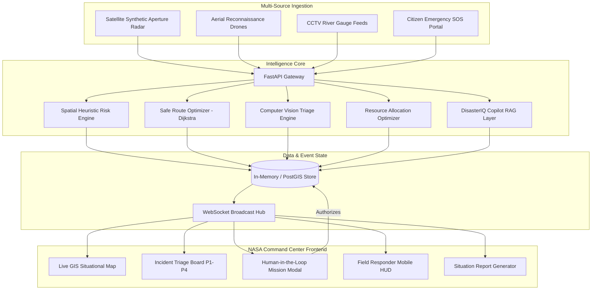

# DISASTERIQ — AI-Powered Disaster Response & Rescue Intelligence Platform

> **"From disaster data to intelligent action."**

[](https://opensource.org/licenses/Apache-2.0)
[](https://www.python.org/)
[](https://fastapi.tiangolo.com/)
[](https://react.dev/)
[](https://www.typescriptlang.org/)
[](https://tailwindcss.com/)
[](https://leafletjs.com/)

---

## 1. Problem Statement
During catastrophic disaster events (such as cyclones, urban inundations, and coastal flash floods), emergency management authorities face extreme information fragmentation. Raw sensor readings, satellite radar passes, drone reconnaissance videos, and frantic civilian emergency calls arrive across disconnected silos. Field dispatchers lack:
1. **Holistic Situational Awareness**: No unified spatial view integrating flood depth, road cutoffs, and hospital capacity.
2. **Explainable Triage**: Inability to quickly prioritize which isolated civilian clusters require immediate life-saving extraction.
3. **Safe Routing**: Convoys get delayed or trapped by submerged culverts and impassable highway choke points.

## 2. Solution: DisasterIQ
**DisasterIQ** is an enterprise-grade, SIH-ready, operational decision-support intelligence platform that fuses multi-source telemetry to automate detection, assess infrastructure damage, compute explainable risk scores, optimize safe water/road transit routes, allocate response units, and generate official situation reports.

> **CRITICAL DECISION-SUPPORT GUARANTEE:**
> DisasterIQ strictly operates as a decision-support system. High-impact emergency actions (dispatching rescue boats, hospital evacuations) require explicit **Human-in-the-Loop** commander authorization (`[APPROVE]` / `[REJECT]`). AI recommendations are paired with transparent heuristic rationales and verified citations.

---

## 3. System Architecture



---

## 4. Key Differentiators & Features

| Feature | Description |
| :--- | :--- |
| **Multi-Source Intelligence** | Fuses drone vision, river gauge telemetry, road statuses, and citizen reports into a unified GIS model. |
| **Explainable AI (XAI)** | Every risk score (0–100) displays contributing factors (e.g., flood depth, blocked access roads, hospital distance). |
| **Human-in-the-Loop (HITL)** | High-impact deployments require explicit commander sign-off before dispatching teams. |
| **Dynamic Spatial Routing** | Graph optimizer penalizes flooded roads and automatically pivots to navigable watercraft routes (e.g., Canal Corridor R-18). |
| **Deterministic Simulation** | 7-step Odisha flood scenario for presentation repeatability with speed controls ($\times 1, \times 2, \times 5$). |
| **DisasterIQ Copilot & RAG** | Conversational operational assistant answering queries with tool calls and NDMA guideline citations. |
| **Offline Resilience** | Detects network degradation, maintains a local sync queue, and ensures field continuity. |
| **Field Responder HUD** | Dedicated lightweight interface for boat crews with single-tap actions: `ACCEPT`, `ARRIVED`, `RESOLVED`. |

---

## 5. Technology Stack

- **Frontend**: React 18, TypeScript, Tailwind CSS 3, Lucide React, Leaflet GIS (CartoDB Dark Matter)
- **Backend**: Python 3.11+, FastAPI, Pydantic v2, WebSockets, Uvicorn
- **AI & RAG**: Python Computer Vision Detector, Keyword/Vector SOP retrieval, Heuristic Spatial Risk Model
- **Containerization**: Docker, Docker Compose, AWS ECS-ready

---

## 6. Repository Structure

```
disasteriq/
├── frontend/ (or root vite project)
│   ├── src/
│   │   ├── components/       # Map, Navbar, Sidebar, StatCards, ApprovalModal
│   │   ├── pages/            # 11 dedicated command views
│   │   ├── services/         # Typed API client and WebSocket handlers
│   │   ├── store/            # State management
│   │   └── types/            # TypeScript interfaces
│   ├── package.json
│   └── vite.config.ts
│
├── backend/
│   ├── app/
│   │   ├── api/routers/      # Disasters, Incidents, Missions, Routing, Vision, Copilot, Simulation
│   │   ├── database/         # Thread-safe in-memory store loaded from demo data
│   │   ├── models/           # Pydantic v2 validation schemas
│   │   ├── services/         # Risk engine, route optimizer, allocator, RAG engine, simulator
│   │   └── main.py           # FastAPI entrypoint & WebSockets
│   └── requirements.txt
│
├── ai/
│   ├── inference/            # Vision and victim detection pipelines
│   └── knowledge/            # NDMA / NDRF Standard Operating Procedures
│
├── data/
│   └── demo/                 # Deterministic Odisha flood scenario dataset
│
├── infrastructure/
│   ├── docker/               # Multi-stage Dockerfiles for frontend & backend
│   └── aws/                  # Cloud architecture specifications
│
├── docs/
│   ├── architecture.md       # Full architecture and Mermaid schemas
│   ├── api.md                # Comprehensive REST and WebSocket API guide
│   └── demo.md               # 3-minute hackathon demo script
│
├── tests/                    # Backend test suites for risk calculation, routing, and simulation
├── docker-compose.yml        # Orchestration for frontend, backend, postgres/postgis, and redis
├── .env.example
├── README.md
└── LICENSE
```

---

## 7. Running Locally

### Prerequisites
- Node.js v18+ and npm
- Python 3.10+

### Option A: Standard Dev Mode

1. **Start Backend (FastAPI)**:
   ```bash
   # Create and activate virtual environment
   python -m venv .venv
   .venv\Scripts\activate   # On Windows
   # source .venv/bin/activate # On Linux/macOS

   # Install dependencies
   pip install -r backend/requirements.txt

   # Run FastAPI server
   python -m uvicorn backend.app.main:app --port 8000 --reload
   ```

2. **Start Frontend (Vite + React)**:
   ```bash
   npm install
   npm run dev
   ```
   Open `http://localhost:5173` in your browser.

---

### Option B: Docker Compose

```bash
docker compose up --build
```
- Frontend: `http://localhost:5173`
- Backend API Docs: `http://localhost:8000/docs`

---

## 8. Hackathon 3-Minute Demo Walkthrough

1. **Command Center Overview (`/dashboard`)**: Observe live statistics across the Mahanadi delta (295,300 affected civilians, 8 critical zones).
2. **Start Deterministic Simulation (`/simulation`)**: Click **START SIMULATION** ($\times 2$ speed) to watch river gauges rise and road R-17 wash out.
3. **Live GIS Situational Map (`/map`)**: Click Zone 7 to inspect real-time flood depth (3.4m) and the 14 stranded victims on the school rooftop.
4. **Ask DisasterIQ Copilot (`/copilot`)**: Submit: *"Which zone should response teams prioritize?"* Copilot queries live telemetry and cites NDMA SOP Section 4.2.
5. **Human-in-the-Loop Mission Approval (`/missions`)**: Review AI recommendation to deploy team **RESCUE-04** via canal route **R-18**. Enter credentials and click **[APPROVE MISSION]**.
6. **Responder Field Mobile HUD (`/mobile-response`)**: Tap **ARRIVED** and **RESOLVED** to rescue all 14 civilians.
7. **Automated Situation Report (`/reports`)**: View the exportable ICS-201 situation report ready for state authorities.

---

## 9. License
Distributed under the Apache 2.0 License. See `LICENSE` for details.
# ResQAi

