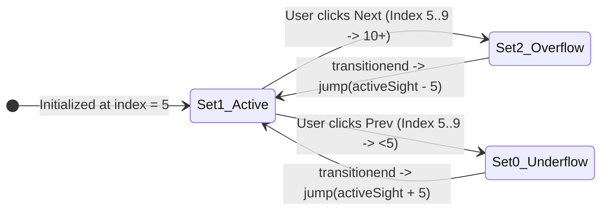

# 🌉 MOSTAR — Cinematic Scroll Experience & Engine

<p align="center">
  
</p>

<p align="center">
  <a href="#-quick-start"></a>
  <a href="#-cinematic-scroll-choreography"></a>
  <a href="#-mathematical-animation-pipeline"></a>
  <a href="#-multi-layer-depth-stack"></a>
  <a href="LICENSE"></a>
</p>

---

## 📖 Executive Overview

**MOSTAR** is a high-fidelity, single-stage cinematic scroll journey through the historic UNESCO landmark of **Mostar, Bosnia and Herzegovina**.

Built entirely in **vanilla web standards** (zero build step, zero heavy frameworks, zero runtime dependencies), it transforms **$3700\text{px}$ of scrubbable viewport scroll** into a living spatial film. Using a custom **Hermite smoothstep interpolation engine**, **7-layer multiplane parallax rig**, and a **tri-set circular buffer infinite slider**, every frame is computed and bound directly to CSS custom properties with zero layout thrashing.

---

## 🎬 Cinematic Scroll Choreography

The composition is pinned to a sticky $100\text{vh}$ stage while the user scrubs through a $3700\text{px}$ travel volume across four synchronized acts:

```mermaid
journey
    title 3700px Scrub Dynamics & Scene Transitions
    section Act I: The Gateway (0 - 650px)
      Hero Title Rises (-210px): 5: Cinematic Engine
      Intro Copy & Tags Sink (+90px): 5: Compositor
      Sky & Parallax Drift Active: 5: Telemetry
    section Act II: Stari Most (560 - 1620px)
      Bridge Arch Expands (67vw -> 105vw): 5: Transformer
      Splitframes Part (±46vw): 5: Transformer
      River Closeup & UNESCO Facts Fade In: 5: Shading
    section Act III: The Old Bazaar (1760 - 2700px)
      Bazaar Saturation Boost (+18%): 5: Color Engine
      Bridge Clears Viewport (-760px): 5: Motion
      Bazaar Panel & Action Pill Active: 5: Interactive
    section Act IV: Sights Slider (2760 - 3700px)
      Slider Enters from 420vw: 5: Sights Rig
      Screen-True Inverse Counter-Scale: 5: Math Core
      Controls Active & Infinite Loop Ready: 5: Controller
```

| Act | Scroll Range | Visual Narrative | Mathematical & Transform State |
|:---:|:---:|---|---|
| **I** | `0px – 650px` | **The Emerald River Gateway**<br>The grand `MOSTAR` title sits atop the stone arch. Intro highlights float gently above the turquoise waters of the Neretva. | • `--title-y`: `0px → -210px`<br>• `--title-scale`: `1.0 → 0.92`<br>• `--intro-copy-y`: `0px → +90px`<br>• `--title-opacity`: `1.0 → 0.0` |
| **II** | `560px – 1620px` | **Stari Most Compass**<br>The iconic stone bridge widens to embrace the screen. Splitframe rocks part symmetrically to unveil the emerald river close-up and UNESCO inscription milestones ($1566$ / $2005$). | • `--bridge-width`: `67.2vw → 105vw`<br>• `--bridge-bottom`: `5vh → -8vh`<br>• `--split-drift`: $\pm 46\text{vw}$ ($enter^{1.5}$)<br>• Global blur: `0px → 14px`<br>• Shade tint: $\text{rgba}(74, 181, 224, \alpha)$ |
| **III** | `1760px – 2700px` | **The Bazaar Keeps Mostar Close**<br>The bridge launches upward into the sky, transitioning to the vibrant Old Town bazaar street. Copper stalls and minarets come into razor-sharp focus. | • `--bazaar-saturation`: `1.0 → 1.18`<br>• `--panel3-opacity`: `0.0 → 1.0`<br>• `--panel3-y`: $+58\text{px} \rightarrow -86\text{px}$ slide<br>• Interactive `↗ Open old town notes` pill |
| **IV** | `2760px – 3700px` | **Infinite Sights Expedition**<br>A card carousel flies in from `420vw` along the X-axis. Round navigation buttons emerge as pointer interactions unlock. | • `--sights-enter-x`: `420vw → 0vw`<br>• `--sights-scale`: $1 / \text{backScale}$ (Screen-True)<br>• Controls opacity: $0 \rightarrow 1$ (Enabled at $> 0.98$)<br>• 15-card circular buffer navigation |

---

## ⚙️ Workflow Model & Animation Pipeline

<p align="center">
  
</p>

The rendering cycle operates on a decoupled **telemetry-to-compositor pipeline** to guarantee **60 FPS fluid playback**:

```
[ Passive Event Ingestion ] ──> [ Inertia Smoothing (Lerp) ] ──> [ Piecewise Segment Resolver ] ──> [ Direct CSS Matrix Injection ]
  • window.scroll                 • smoothScroll (t = 0.14)         • smoothstep(e0, e1, s)            • --bridge-width, --back-scale
  • pointermove                   • mouseX/Y (t = 0.12)             • segmentInOut(a, b, c, d)         • Zero Reflow / GPU Composite
```

### 1. Inertial Interpolation & Dampening
Raw window scroll events and mouse coordinates are decoupled from the render loop via linear interpolation ($\text{lerp}$):

$$\text{smoothScroll}_{t+1} = \text{lerp}(\text{smoothScroll}_t, \text{targetScroll}, 0.14)$$

$$\mu_{t+1} = \text{lerp}(\mu_t, \text{targetPointer}, 0.12)$$

*Convergence threshold*: When $|\text{smoothScroll} - \text{targetScroll}| < 0.08\text{px}$, values snap to avoid micro-jitter and idle rAF waste.

### 2. Hermite Smoothstep Curves
Segment boundaries use cubic Hermite polynomials for first-derivative continuity ($C^1$ smooth starts and endings without sudden velocity spikes):

$$S(x) = 3x^2 - 2x^3 \quad \text{where} \quad x = \text{clamp}\left(\frac{v - e_0}{e_1 - e_0}, 0, 1\right)$$

### 3. Screen-True Counter-Scaling Equation
The sights slider resides inside the `.back-stack`, which dynamically zooms under `--back-scale` ($0.76 \rightarrow 1.30$). To prevent the sight cards from ballooning or shrinking unpredictably on screen, the engine computes an inverse counter-scale:

$$\text{Scale}_{\text{sights}} = \frac{1}{\text{backScale}} \implies \text{Effective Screen Scale} \equiv 1.000$$

$$\text{Top}_{\text{parent}} = H_{\text{screen}} - \frac{H_{\text{screen}} - \text{Top}_{\text{screen}}}{\text{backScale}}$$

This ensures the sight cards maintain constant physical dimensions and pixel-crisp typography regardless of background zoom depth!

---

## 🔄 Tri-Set Infinite Slider Circular Buffer

<p align="center">
  
</p>

To provide a seamless, non-exhausting carousel without edge deadlocks, the slider mounts **3 identical sets of cards** ($3 \times 5 = 15$ cards):



1. **Active Starting Domain (`Set 1`)**: Indices `5..9`. The initial view displays Card #5 (`Stari Most`).
2. **Smooth Sliding (`640ms cubic-bezier(0.22, 1, 0.36, 1)`)**:
   $$\Delta X = -\left(\text{CardWidth} + \text{Gap}\right) \times \text{activeSight}$$
3. **Double-rAF Instant Jump Normalization**:
   When the transition finishes on either outer set:
   - Add `.is-jumping` (disables CSS transition).
   - Normalize index: $\text{activeSight} \gets \text{activeSight} \pm 5$.
   - Apply updated translation.
   - Use two nested `requestAnimationFrame()` passes before removing `.is-jumping`, completely masking the repositioning from the human eye.

---

## 🏛️ Multi-Layer Depth Stack

Source order defines the GPU paint order across identical z-indices:

```
main.site-shell
└─ section.cinema-scroll#cinema (Height: calc(100vh + 3700px))
   └─ div.stage (position: sticky; top: 0; 100vh)
      ├─ div.world
      │  ├─ [z=0]  img.sky-img                      (Farthest sky background)
      │  ├─ [z=10] header.site-header                (Logo, Nav links, EN switcher)
      │  ├─ [z=1]  div.back-stack                   (Parallax container: scale 0.76 -> 1.30)
      │  │  ├─ [z=1] img.back-four                   (Atmospheric glow layer)
      │  │  ├─ [z=2] section.sights-slider           (15-card tri-set track)
      │  │  └─ [z=3] img.back-bazaar                 (Old Town copper quarter)
      │  ├─ [z=5]  div.sights-controls               (Round ← and → buttons)
      │  ├─ [z=3]  h1.hero-title                     (MOSTAR display serif)
      │  ├─ [z=6]  img.splitframe-left / right      (Symmetric parting cliffs)
      │  ├─ [z=4]  img.bridge-img                    (Stari Most stone arch)
      │  ├─ [z=5]  img.frame-two-img                 (High-res river closeup)
      │  └─ [z=2]  div.shade                         (Dynamic 3-stop tint gradient)
      ├─ [z=9]  section.intro-copy                   (Intro narrative & 3 highlight pills)
      ├─ [z=10] section.story-panel-bridge           (Compass story & facts 1566 / 2005)
      └─ [z=10] section.story-panel-bazaar           (Bazaar story & action button)
```

---

## 🚀 Quick Start

### Option A: Zero-Dependency Standalone Run
Because all fonts and scene assets load directly from authorized CDNs, no build tools or package managers are required.

```bash
# 1. Clone the repository
git clone https://github.com/exepngsam/ResQAi.git
cd ResQAi

# 2. Open directly in your browser
start index.html       # Windows
open index.html        # macOS
xdg-open index.html    # Linux
```

### Option B: Local HTTP Server (Python / Node)
```bash
# Via Python
python -m http.server 3000

# Via Node.js
npx serve .
```
Navigate to `http://localhost:3000` to experience the 60 FPS scroll.

---

## ♿ Accessibility & Reduced Motion

The implementation adheres to strict accessibility standards:
- **`prefers-reduced-motion: reduce`**:
  - Automatically disables inertia lerping and forces instantaneous scroll sync.
  - Locks pointer parallax (`--mx` and `--my` pinned to `0`).
  - Removes CSS transitions for instant, motion-sick-free navigation.
- **Full Keyboard Navigation**:
  - `Tab` navigation through all sight cards.
  - `Enter` or `Space` selects and focuses any card.
  - Aria labels on all interactive controls (`aria-label="Open Stari Most card"`, `aria-label="Slider controls"`).

---

## 📂 Project Structure

```
├── index.html               # Semantic, standalone Mostar story DOM
├── styles.css               # Exact CSS custom properties & layout matrix
├── script.js                # 60 FPS animation engine & infinite slider
├── assets/
│   ├── hero-animated.svg    # Animated SVG hero banner
│   ├── workflow-animated.svg# Animated workflow pipeline diagram
│   └── slider-architecture.svg # Infinite slider buffer diagram
├── index.resqai.html        # DisasterIQ Emergency Command Center interface
├── backend/                 # Disaster response FastAPI microservices
├── src/                     # React / Leaflet telemetry modules
└── README.md                # Comprehensive documentation
```

---

<p align="center">
  Crafted with precision for <b>Mostar, Bosnia and Herzegovina</b> 🇧🇦<br>
  <sub>Architected with Vanilla Web Standards · 60 FPS Hardware Composited</sub>
</p>