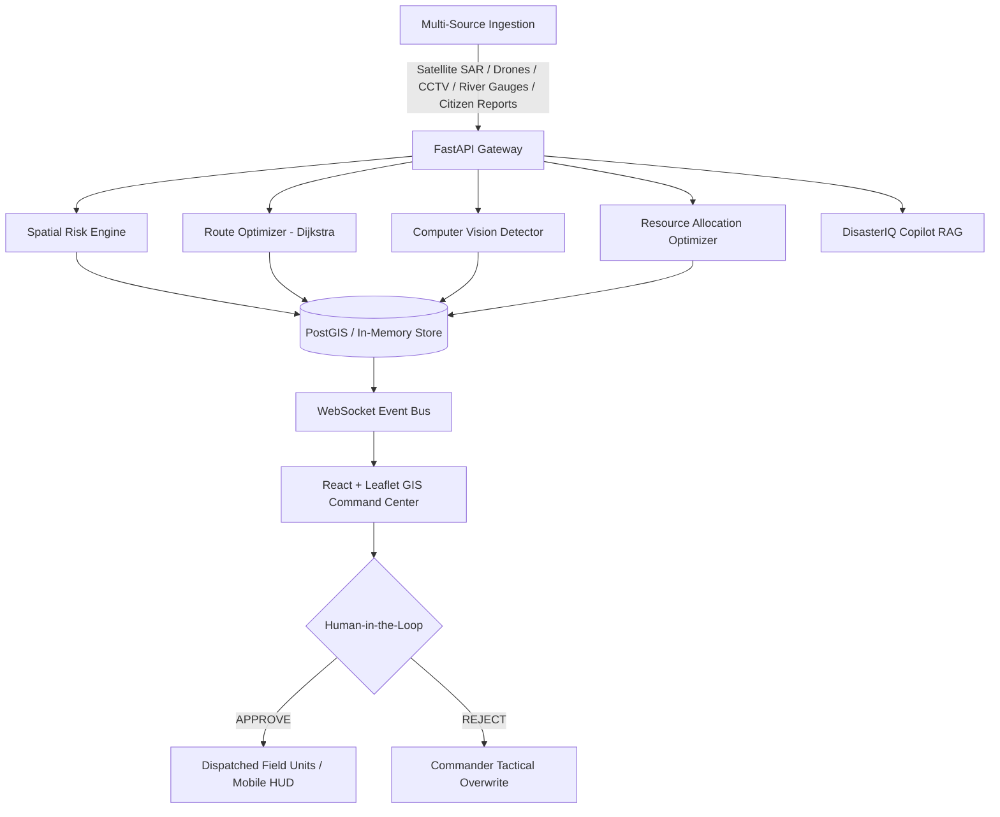

# DISASTERIQ — Technical Architecture

## 1. System Vision & Paradigm
**DisasterIQ** is an operational decision-support intelligence platform transforming fragmented multi-source emergency telemetry (satellite SAR, drone video, river gauges, IoT sensors, citizen reports) into actionable, explainable rescue operations.

## 2. Decision Support Guarantee & Human-in-the-Loop
High-impact emergency directives (dispatching rescue teams, reallocating critical trauma resources, mandatory evacuation orders) require explicit human commander approval via `[APPROVE]` and `[REJECT]` interfaces. Automated models provide recommendations with transparent, contributing heuristic reasons.

## 3. Heuristic Risk Scoring Formula
$$\text{Risk Score} = 0.30 \cdot \text{PopRisk} + 0.25 \cdot \text{FloodDepth} + 0.20 \cdot \text{RoadCutoff} + 0.15 \cdot \text{VictimDensity} + 0.10 \cdot \text{HospitalDistance}$$
- 0–25: LOW
- 26–50: MODERATE
- 51–75: HIGH
- 76–100: CRITICAL
